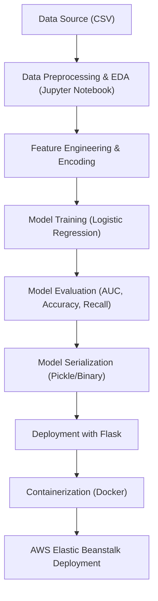

# Customer Churn Prediction

This project demonstrates the complete ML lifecycle, from raw data to an automated, production-ready churn prediction API showing how machine learning can create real-world business value through insight, foresight, and intelligent automation.

## 🧩 Problem Statement

Customer churn being the rate at which customers stop doing business with a company. This is a critical problem across industries.  

Retaining existing customers is significantly cheaper than acquiring new ones, yet many organizations struggle to identify **which customers are at risk of leaving** before it happens.

The goal of this project is to **build, evaluate, and deploy** a machine learning model that predicts the likelihood of churn for each customer, allowing businesses to take proactive retention actions.

---

## 🗂️ Data Source

The dataset used in this project comes from a **telecommunications customer dataset**, containing customer-level information such as:

- **Demographics:** Gender, Senior Citizen, Partner, Dependents  
- **Subscription Details:** Internet service type, contract length, payment method  
- **Usage Behavior:** Monthly charges, tenure, total charges  
- **Target Variable:** `Churn` (Yes/No)

The dataset was preprocessed and cleaned in a Jupyter Notebook environment before model training.

---

## 🔬 Process Overview

Below is the end-to-end workflow from raw data to deployment:

## ⚙️ Solution Walkthrough

---

1. Data Preprocessing & Feature Engineering

Missing values were handled and categorical variables encoded.

Numerical features were scaled to standardize model input.

Key features included:
`tenure`, `MonthlyCharges`, `ContractType`, `InternetService`, `PaymentMethod`, etc.

---

2. Model Building

A Logistic Regression model was trained to classify customers as:

0 → Will Stay

1 → Will Churn

The model was selected for:

Interpretability (feature importance & explainability)

Speed (lightweight and efficient for real-time predictions)

Robustness with small-to-medium datasets

---

3. Model Evaluation

Accuracy:	0.82

AUC (ROC):	0.91

Recall:	0.87

Precision:	0.79

These results indicate strong discriminative ability to identify customers likely to churn.

---

4. Deployment Workflow

* The trained model was serialized as a .bin file.

* A FastAPI app (predict-service.py) was created to expose a REST API endpoint for predictions.

* The API takes customer attributes as JSON input and returns churn probability and classification.

* The service was containerized using Docker and deployed on AWS Elastic Beanstalk for production scalability.

## 🧰 Technologies Used

| Category | Tools / Libraries |
|:-----------|:-------------------|
| **Language** | Python 3.12 |
| **Data Analysis** | Pandas, NumPy |
| **Modeling** | Scikit-learn |
| **API Development** | Flask, gunicorn |
| **Environment Management** | Pipenv |
| **Containerization** | Docker |
| **Deployment** | AWS Elastic Beanstalk |
| **Version Control** | Git & GitHub |

---

## 🌍 Real-World Applications

### 📞 Telecommunications
- Predict which subscribers are most likely to **cancel or switch carriers** based on usage and engagement patterns.  
- Trigger **personalized retention offers** (e.g., bonus data, discounts) before churn occurs.  
- Optimize **customer support prioritization** by flagging high-risk users early.  

### 🏦 Banking & Fintech
- Identify customers likely to **close accounts or reduce card activity**, helping prevent revenue loss.  
- Power **proactive retention campaigns** such as loyalty programs or fee waivers for at-risk users.  
- Improve **credit risk profiling** by integrating behavioral churn signals into lending models.  

### 🎮 SaaS / Gaming Platforms
- Detect users who are becoming **inactive or disengaged** before subscription renewal dates.  
- Launch **re-engagement campaigns** (e.g., bonus features, limited-time rewards) to retain them.  
- Forecast **user lifetime value (LTV)** and allocate marketing spend more efficiently.  

### 🛍️ E-commerce & Retail
- Predict **which repeat buyers are likely to churn**, and automate targeted offers to retain them.  
- Support **dynamic pricing and discounting systems** focused on high-value or loyal customers.  
- Feed **personalized recommendation engines** to keep users active and increase purchase frequency.  

### 💸 Crypto & Web3 Platforms
- Identify **traders or users likely to leave** a DEX, staking platform, or NFT marketplace.  
- Trigger **gas fee rebates, trading incentives, or loyalty NFTs** to encourage continued engagement.  
- Strengthen **ecosystem health metrics** by retaining valuable wallet addresses and active users.  

---

##  Business Impact

1. By integrating this model into a company’s CRM or marketing pipeline:

2. Customer retention can increase by 10–20%.

3. Marketing spend can be reduced by focusing on high-risk customers.

4. Revenue stability improves through early intervention and loyalty programs.

5. This solution transforms data into a decision-making tool that helps companies retain customers, cut costs, and improve lifetime value.

